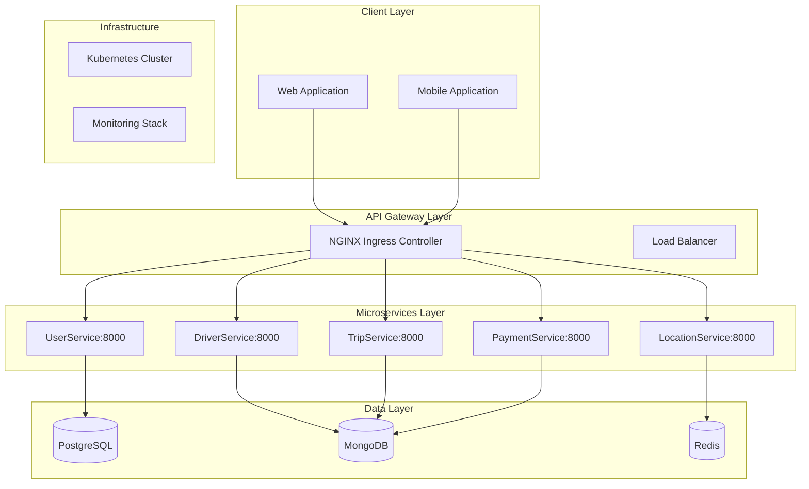

# UIT-Go Architecture Documentation

## Table of Contents
1. [Overview](#overview)
2. [System Architecture](#system-architecture)
3. [Microservices](#microservices)
4. [Data Storage](#data-storage)
5. [Communication Patterns](#communication-patterns)
6. [Security](#security)
7. [Infrastructure](#infrastructure)
8. [Deployment](#deployment)
9. [Monitoring & Observability](#monitoring--observability)

## Overview

UIT-Go is a microservices-based ride-sharing application built with FastAPI and deployed on Kubernetes. The system follows a service-oriented architecture pattern with clear separation of concerns, scalability, and maintainability in mind.

### Key Features
- **User Management**: Registration, authentication, profile management
- **Driver Services**: Driver registration, location tracking, status management
- **Trip Management**: Ride booking, tracking, payment integration
- **Location Services**: Geospatial data, routing, location tracking
- **Payment Processing**: Integration with VNPAY for Vietnamese market

## System Architecture



## Microservices

### UserService (Port 8000)
**Technology Stack**: FastAPI, PostgreSQL, SQLAlchemy, AsyncPG

**Responsibilities**:
- User registration and authentication
- JWT token management
- Profile management
- User type management (PASSENGER/DRIVER)
- Email and phone verification

**Database Schema**:
```sql
users (id, username, email, password_hash, full_name, phone, user_type, is_active, created_at, updated_at)
driver_profiles (user_id, license_number, vehicle_info, rating, total_trips)
```

### DriverService (Port 8000)
**Technology Stack**: FastAPI, MongoDB, Motor (Async MongoDB)

**Responsibilities**:
- Driver registration and verification
- Real-time location tracking
- Driver status management (ONLINE/OFFLINE/ON_TRIP)
- Driver rating system
- Vehicle management

**Data Model**:
```javascript
drivers: {
  _id: ObjectId,
  user_id: String,
  license_number: String,
  status: "ONLINE" | "OFFLINE" | "ON_TRIP",
  current_location: { lat: Number, lng: Number },
  vehicle: {
    make: String,
    model: String,
    license_plate: String,
    color: String,
    year: Number
  },
  rating: Number,
  total_trips: Number,
  created_at: Date,
  updated_at: Date
}
```

### TripService (Port 8000)
**Technology Stack**: FastAPI, MongoDB, Motor, MapBox API

**Responsibilities**:
- Trip creation and management
- Driver matching algorithm
- Real-time trip tracking
- Route calculation
- Trip status updates
- Fare calculation

**Data Model**:
```javascript
trips: {
  _id: ObjectId,
  passenger_id: String,
  driver_id: String,
  status: "REQUESTED" | "ACCEPTED" | "IN_PROGRESS" | "COMPLETED" | "CANCELLED",
  pickup_location: { lat: Number, lng: Number, address: String },
  dropoff_location: { lat: Number, lng: Number, address: String },
  route: Array,
  fare: {
    base_fare: Number,
    distance_fare: Number,
    time_fare: Number,
    total: Number
  },
  payment_status: String,
  created_at: Date,
  updated_at: Date
}
```

### LocationService (Port 8000)
**Technology Stack**: FastAPI, Redis, MapBox API

**Responsibilities**:
- Location validation and geocoding
- Distance calculation
- Route optimization
- Nearby driver search
- Location caching

**Cache Structure**:
```
driver_locations: {
  driver_id: { lat, lng, last_updated, status }
}
```

### PaymentService (Port 8000)
**Technology Stack**: FastAPI, MongoDB, VNPAY Integration

**Responsibilities**:
- Payment processing with VNPAY
- Payment transaction management
- Refund processing
- Wallet management
- Payment history

**Data Model**:
```javascript
payments: {
  _id: ObjectId,
  trip_id: String,
  user_id: String,
  amount: Number,
  status: "PENDING" | "COMPLETED" | "FAILED" | "REFUNDED",
  payment_method: String,
  vnpay_transaction_id: String,
  created_at: Date,
  updated_at: Date
}
```

## Data Storage

### PostgreSQL (UserService)
- **Purpose**: Relational data with ACID compliance
- **Database**: `mydb`
- **Tables**: users, driver_profiles
- **Connection**: AsyncPG for async operations

### MongoDB (Driver, Trip, Payment Services)
- **Purpose**: Document storage for flexible schemas
- **Database**:
  - `uitgo_drivers`
  - `uitgo_trips`
  - `uitgo_payments`
- **Connection**: Motor for async operations

### Redis (LocationService)
- **Purpose**: Real-time location caching and session management
- **Data Types**: Strings, Hashes, Sorted Sets
- **TTL**: Location data expires after 5 minutes

## Communication Patterns

### Synchronous Communication
- **HTTP/REST API**: Direct service-to-service calls
- **Authentication**: JWT tokens passed in Authorization headers
- **Timeouts**: Configured via NGINX annotations (300s)

### Asynchronous Communication
- **Real-time Updates**: WebSocket connections via ingress-websocket
- **Location Updates**: Redis pub/sub for driver location broadcasts

### Service Discovery
- **Kubernetes DNS**: Services discoverable via `servicename.namespace.svc.cluster.local`
- **Load Balancing**: Kubernetes services with round-robin load balancing

## Security

### Authentication & Authorization
- **JWT Tokens**: HS256 algorithm with configurable secret key
- **Token Expiration**: 30 minutes for access tokens
- **User Types**: PASSENGER, DRIVER with different permissions

### Network Security
- **NGINX Ingress**: SSL termination, rate limiting, CORS configuration
- **Pod Security**: Non-root user execution (UID 1000)
- **Resource Limits**: CPU and memory constraints per pod

### Data Security
- **Password Hashing**: bcrypt with salt
- **Environment Variables**: Sensitive data stored in Kubernetes secrets
- **Database Security**: Encrypted connections, least privilege access

## Infrastructure

### Kubernetes Cluster
- **Ingress Controller**: NGINX with custom configurations
- **Service Types**:
  - LoadBalancer for external access (ingress-nginx-controller)
  - ClusterIP for internal service communication
- **Namespaces**:
  - `default`: Application services
  - `ingress-nginx`: Ingress infrastructure

### Container Security
- **Base Images**: Minimal Python 3.11 Alpine images
- **Security Context**: Non-root execution, read-only filesystems
- **Resource Limits**: CPU and memory requests/limits configured

### CI/CD Pipeline
- **GitHub Actions**: Automated testing and deployment
- **Security Scanning**:
  - DAST scanning with OWASP ZAP
  - Dependency scanning with Safety
  - Secrets scanning with TruffleHog

## Deployment

### Environment Configuration
- **Docker Compose**: Local development environment
- **Kubernetes**: Production deployment on AKS
- **Configuration Management**: Environment variables and ConfigMaps

### Scaling Strategy
- **Horizontal Pod Autoscaling**: Configured for high-traffic services
- **Database Scaling**: Read replicas for PostgreSQL, sharding potential for MongoDB
- **Caching**: Redis for frequently accessed data

### Deployment Architecture
```yaml
# Example Service Configuration
apiVersion: v1
kind: Service
metadata:
  name: userservice
spec:
  selector:
    app: userservice
  ports:
  - port: 80
    targetPort: 8000
  type: ClusterIP
```

## Monitoring & Observability

### Logging
- **Fluent Bit**: Centralized log collection
- **Structured Logging**: JSON format for log aggregation
- **Log Levels**: INFO, WARNING, ERROR with appropriate categorization

### Health Checks
- **Readiness Probes**: Application readiness verification
- **Liveness Probes**: Container health monitoring
- **Custom Endpoints**: `/health` for service-specific health checks

### Security Monitoring
- **DAST Scanning**: OWASP ZAP baseline scans on every deployment
- **Security Headers**: X-Content-Type-Options, CSP recommendations
- **CORS Configuration**: Secure cross-origin resource sharing

### Performance Monitoring
- **Response Time Monitoring**: Ingress-level timeout configurations
- **Resource Utilization**: Kubernetes metrics-server integration
- **Error Rate Tracking**: Service-level error monitoring

## API Endpoints

### UserService
- `POST /api/users/auth/register` - User registration
- `POST /api/users/auth/login` - User authentication
- `GET /api/users/profile` - Get user profile
- `PUT /api/users/profile` - Update user profile

### DriverService
- `POST /api/drivers/register` - Driver registration
- `PUT /api/drivers/location` - Update driver location
- `GET /api/drivers/nearby` - Find nearby drivers
- `PUT /api/drivers/status` - Update driver status

### TripService
- `POST /api/trips/request` - Request a trip
- `PUT /api/trips/{trip_id}/accept` - Accept trip
- `GET /api/trips/{trip_id}/status` - Get trip status
- `PUT /api/trips/{trip_id}/complete` - Complete trip

### LocationService
- `GET /api/locations/geocode` - Geocode address
- `POST /api/locations/route` - Calculate route
- `GET /api/locations/distance` - Calculate distance

### PaymentService
- `POST /api/payments/create` - Create payment
- `POST /api/payments/vnpay/callback` - VNPAY callback
- `GET /api/payments/history` - Payment history

## Development Guidelines

### Code Structure
```
ServiceName/
├── main.py          # FastAPI application
├── models.py        # Pydantic models
├── schemas.py       # Database schemas
├── crud.py          # Database operations
├── auth.py          # Authentication logic
├── database.py      # Database connection
├── requirements.txt # Dependencies
└── Dockerfile       # Container configuration
```

### Testing
- **Unit Tests**: pytest with mocking
- **Integration Tests**: API endpoint testing
- **E2E Tests**: Full workflow testing
- **Smoke Tests**: Post-deployment verification

### Best Practices
- **Async/Await**: Non-blocking I/O operations
- **Error Handling**: Comprehensive exception management
- **Input Validation**: Pydantic model validation
- **Logging**: Structured logging with appropriate levels

## Future Enhancements

### Scalability
- **Event-Driven Architecture**: Apache Kafka for event streaming
- **Microservice Mesh**: Istio for service mesh capabilities
- **Database Optimization**: Read replicas, connection pooling

### Security
- **Zero Trust Architecture**: Mutual TLS between services
- **Advanced Authentication**: OAuth2.0 with refresh tokens
- **API Rate Limiting**: User-based rate limiting

### Performance
- **Caching Strategy**: Multi-level caching implementation
- **Database Optimization**: Query optimization, indexing strategies
- **Load Testing**: Automated performance testing

---

## Architecture Decision Records (ADRs)

Key architectural decisions are documented in the `docs/adrs/ directory, including:
- [ADR-002: Database Selection Strategy](docs/adrs/ADR-002-database-selection.md)
- [ADR-003: Authentication Framework](docs/adrs/ADR-003-authentication-strategy.md)
- [ADR-004: OSS Security Tools Integration](docs/adrs/ADR-004-oss-security-tools.md)

---

*Last Updated: November 2025*
*Version: 1.0*